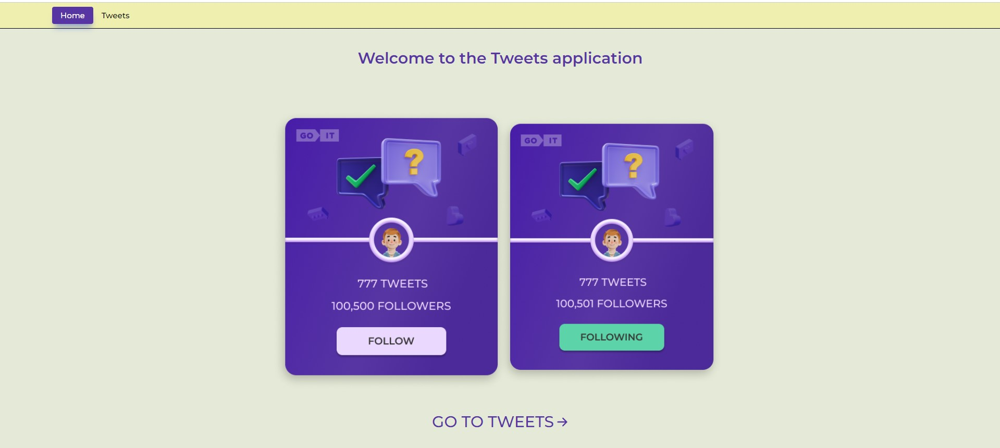

# UserCardFollowers

UserCardFollowers is a simple web application that allows a user to get a list of their Github followers in the form of cards with information about them.

## How to use

To use the application, follow these steps:

1. Clone the repository to your computer: `git clone https://github.com/AlenaUshakova/UserCardFollowers.git`
2. Navigate to the project directory: `cd UserCardFollowers`
3. Install dependencies: `npm install`
4. Start the development server: `npm start`
5. Open your favorite browser and navigate to `http://localhost:3000.`
7. You will see a list of the home page and by clicking on the cards or "GO TO TWEETS" you can go to a page with all the users and subscribe to some of them

## Technologies

The project is built with React and uses the Axios library to interact with the Github API.

## Author

Alena Ushakova - Software Developer

